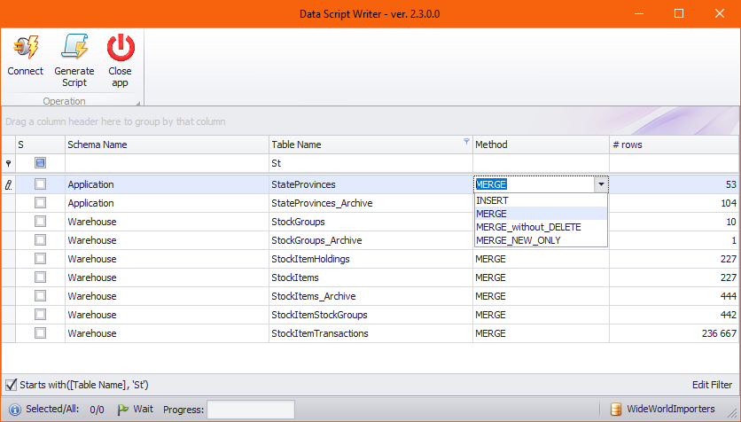

# Data Script Writer
### current version: 2.4.0 ([download](https://github.com/Azure-Player/DataScriptWriter/releases/download/v2.4/DataScriptWriter_v2.4.0.zip))

# Releases
Releases & Application (binaries) can be downloaded from here:  
https://github.com/Azure-Player/DataScriptWriter/releases/

# User Manual
Blog post & video:
- [Script and deploy the data for database from SSDT project](https://azureplayer.net/2019/10/script-deploy-the-data-for-database-from-ssdt-project/)
- [SSDT: Scripting static data from SQL Server (video)](https://azureplayer.net/2020/04/ssdt-scripting-static-data-from-sql-server-video/)

# Screenshot

